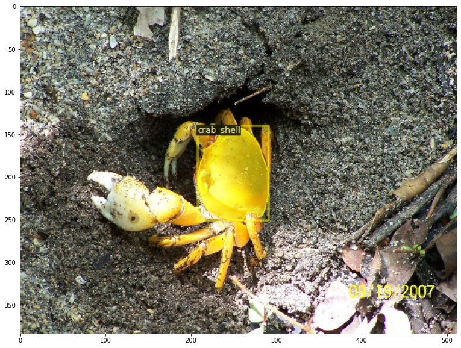

# Crab Shell Width Estimation

This project involves processing a video taken by a Remote Operated Vehicle (ROV) to estimate the width of crab shells using computer vision techniques. The project uses various technologies including Azure Custom Vision, Detectron2, and PyTorch.

## Project Overview

1. **Data Collection and Annotation**:
    - Collected crab data from various sources including MBARI, Google Open Image dataset, and Google Image search.
    - Annotated images using LabelImg and uploaded them to Google Drive.
    - Converted annotations to Azure Custom Vision format.

2. **Frame Extraction and Image Filtering**:
    - Exported unique frames from the video by tracking points until they were outside the frame.
    - Uploaded frames to Azure Custom Vision for detection.
    - Filtered detection probabilities and cropped detected crabs.

3. **Instance Segmentation Model**:
    - Created an instance segmentation model using Detectron2 and PyTorch.
    - Converted annotations from LabelMe format to COCO format.
    - Trained the model and used it for inference to detect crab shells.

4. **Width Estimation**:
    - Calculated the distance between two red dots in the video to establish a pixel-to-centimeter ratio.
    - Estimated crab shell widths and saved the data to a CSV file.

## Getting Started

### Prerequisites

- Python 3.7+
- PyTorch
- Detectron2
- OpenCV
- Pandas
- LabelImg

### Installation

1. Clone the repository:
    ```bash
    git clone https://github.com/MatthewNader2/Crab-Shell-Width-Estimation.git
    cd crab-shell-width-estimation
    ```

2. Install the required dependencies:
    ```bash
    pip install -r requirements.txt
    ```

3. Set up the Detectron2 environment:
    ```bash
    python -m pip install 'git+https://github.com/facebookresearch/detectron2.git'
    ```

### Usage

1. Annotate images and upload to Google Drive.
2. Convert annotations to Azure Custom Vision format.
3. Use the provided scripts to extract frames from the video, upload to Azure Custom Vision, and filter detections.
4. Train the instance segmentation model and use it for inference.
5. Calculate crab shell widths using the pixel-to-centimeter ratio and save the results to a CSV file.

### Code Structure

- `data/`: Contains the annotated images and CSV files.
- `scripts/`: Contains the scripts for data preprocessing, model training, and inference.
- `notebooks/`: Jupyter notebooks for exploratory data analysis and model evaluation.

### Examples

Here are some sample images used in the project:


.png)
.png)

### License

This project is licensed under the MIT License - see the [LICENSE](LICENSE) file for details.

## Acknowledgments

- MBARI
- Google Open Image Dataset
- Facebook AI Research (FAIR) for Detectron2
